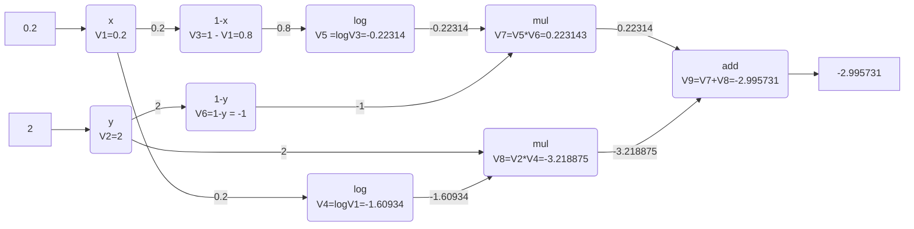

测试

```mermaid
flowchart LR
    x_input[0.2]
    y_input[2]
    x(x\nV1=0.2)
    y(y\nV2=2)
    one_minus_x(1-x\nV3=1 - V1=0.8)
    one_minus_y(1-y\n V6=1-y = -1)
    log_x(log\nV4=logV1=-1.60934)
    log_one_minus_x(log\nV5 =logV3=-0.22314)
    mul_logx_y(mul\nV8=V2*V4=-3.218875)
    mul_one_minus_y_log_one_minus_x(mul\nV7=V5*V6=0.223143)
    add(add\nV9=V7+V8=-2.995731)


    x_input --> x
    y_input --> y
    x -->|0.2| log_x
    x -->|0.2| one_minus_x
    y -->|2| one_minus_y
    y ---->|2| mul_logx_y
    log_x -->|-1.60934| mul_logx_y
    one_minus_x -->|0.8| log_one_minus_x
    log_one_minus_x -->|-0.22314| mul_one_minus_y_log_one_minus_x
    one_minus_y --->|-1| mul_one_minus_y_log_one_minus_x
    mul_one_minus_y_log_one_minus_x --> |0.22314|add
    mul_logx_y--> |-3.218875|add
add -->-2.995731
```
